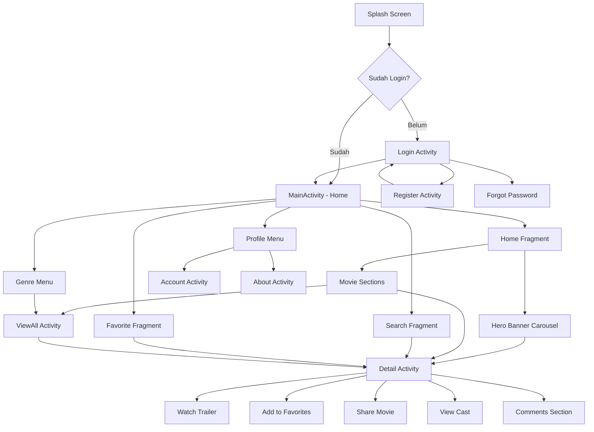

# PortalFilm 🎬

**Aplikasi Android Movie Database** - Platform untuk mencari, melihat detail, dan menyimpan film favorit menggunakan TMDB API.

---

## 📱 Deskripsi Aplikasi

**PortalFilm** adalah aplikasi mobile berbasis Android yang memungkinkan pengguna untuk:
- 🔍 Mencari dan menjelajahi film-film populer, trending, top rated, dan upcoming
- 📺 Menonton trailer film langsung dari YouTube
- ⭐ Menyimpan film favorit ke dalam daftar "My List"
- 👥 Melihat informasi lengkap film termasuk cast, genre, rating, dan sinopsis
- 💬 Membaca dan menulis komentar untuk setiap film
- 🔐 Sistem autentikasi dengan login dan registrasi

---

## ✨ Fitur Utama

### 1. **Autentikasi Pengguna**
   - Login & Register dengan validasi
   - Session management untuk menjaga status login
   - Forgot Password functionality
   - Database SQLite lokal untuk menyimpan data user

### 2. **Home Screen dengan Hero Banner**
   - ViewPager2 carousel dengan auto-scroll untuk menampilkan film populer
   - Indikator dots untuk navigasi carousel
   - Multiple sections: Popular, Top Rated, Now Playing, Upcoming, Trending, Best 2024

### 3. **Detail Film**
   - Backdrop poster dengan desain Netflix-style
   - Trailer YouTube dengan thumbnail preview
   - Rating, release date, duration, dan genre
   - Cast & Crew dengan foto profil
   - Tombol Add to Favorites / Remove from Favorites
   - Share film via social media
   - Sistem komentar (like & reply)

### 4. **Search & Filter**
   - Pencarian film berdasarkan nama
   - Filter berdasarkan genre (Action, Comedy, Drama, Horror, Sci-Fi, dll)
   - View All untuk masing-masing kategori dengan pagination

### 5. **My List (Favorites)**
   - Simpan film favorit secara offline di database SQLite
   - Akses cepat ke daftar film favorit

### 6. **Profile & Account**
   - Menampilkan informasi user
   - About App dengan informasi pengembang

---

## 🎯 Alur Aplikasi (Application Flow)

Berikut adalah alur lengkap aplikasi PortalFilm yang dapat dijelaskan saat presentasi:



### 📍 Penjelasan Alur:

#### **1. Splash Screen → Authentication**
```
SplashActivity.java
├── Cek status login di SharedPreferences
├── Jika sudah login → MainActivity
└── Jika belum login → LoginActivity
```

- **Durasi**: 1.5 detik
- **Logic**: Mengecek `SharedPreferences` key `isLoggedIn`
- **Navigation**: Menggunakan `Intent` untuk berpindah activity

#### **2. Login & Register Flow**
```
LoginActivity.java
├── Input username & password
├── Validasi dengan DatabaseHelper (SQLite)
├── Simpan session dengan SessionManager
└── Navigate ke MainActivity

RegisterActivity.java
├── Input data user (username, email, password)
├── Validasi format & kecocokan password
├── Insert ke database SQLite
└── Kembali ke LoginActivity
```

- **Database**: SQLite dengan `DatabaseHelper`
- **Session**: Menggunakan `SessionManager` (SharedPreferences wrapper)

#### **3. Main Activity - Navigation**
```
MainActivity.java
├── MaterialToolbar dengan logo & navigation
├── Genre Dropdown Menu (PopupMenu)
├── My List Navigation
├── Search Icon
├── Profile Menu (Settings & About)
└── Fragment Container
    ├── HomeFragment (default)
    ├── FavoriteFragment
    └── SearchFragment
```

- **Architecture**: Single Activity dengan Multiple Fragments
- **Navigation**: Fragment Transaction untuk berpindah fragment

#### **4. Home Fragment - Movie Display**
```
HomeFragment.java
├── Hero Banner (ViewPager2)
│   ├── Popular Movies (Top 5)
│   ├── Auto-scroll setiap 4 detik
│   └── Dot indicators
│
├── Popular Section (RecyclerView Horizontal)
├── Top Rated Section
├── Now Playing Section
├── Upcoming Section
├── Trending Section
└── Best 2024 Section

Setiap Section:
├── TextView Title dengan "See All" link
├── RecyclerView Horizontal
├── MovieAdapter untuk binding data
└── OnClick → DetailActivity
```

**API Calls** (menggunakan Retrofit):
- `getPopularMovies()`
- `getTopRatedMovies()`
- `getNowPlayingMovies()`
- `getUpcomingMovies()`
- `getTrendingMovies()`

#### **5. Detail Activity - Movie Information**
```
DetailActivity.java
├── Load Movie Detail dari TMDB API
│   ├── getMovieDetail(movieId)
│   ├── getMovieCredits(movieId) untuk cast
│   └── getMovieVideos(movieId) untuk trailer
│
├── UI Components:
│   ├── Backdrop Image (Glide)
│   ├── Title, Tagline, Rating
│   ├── YouTube Trailer Thumbnail
│   ├── Genre Chips
│   ├── Duration & Languages
│   ├── Overview/Synopsis
│   ├── Cast RecyclerView (Horizontal)
│   ├── Favorite Button (Toggle)
│   ├── Share Button
│   └── Comments Section
│
└── Actions:
    ├── Toggle Favorite → Save/Remove dari SQLite
    ├── Play Trailer → Open YouTube dengan Intent
    ├── Share → Share Intent dengan movie info
    └── Comment → Add to local list & display
```

**Database Operations**:
- Check favorite status: `isFavorite(movieId)`
- Add to favorites: `addFavorite(movie)`
- Remove from favorites: `removeFavorite(movieId)`

#### **6. Search Fragment**
```
SearchFragment.java
├── SearchView dengan real-time search
├── API Call: searchMovies(query)
├── Display hasil dalam GridLayout
└── OnClick → DetailActivity
```

#### **7. Favorite Fragment**
```
FavoriteFragment.java
├── Load favorites dari SQLite (DatabaseHelper)
├── Display dalam RecyclerView Grid
├── Jika kosong → Show empty state
└── OnClick → DetailActivity
```

#### **8. ViewAll Activity**
```
ViewAllActivity.java
├── Menerima CATEGORY & TITLE dari Intent
├── Load movies berdasarkan kategori
├── Pagination support (page++)
├── RecyclerView Grid untuk display
└── OnClick → DetailActivity
```

**Kategori yang didukung**:
- `popular`, `top_rated`, `now_playing`, `upcoming`, `trending`, `genre`

---

---

## 📍 Lokasi Komponen Teknis

Berikut adalah pemetaan komponen teknis utama ke file source code:

### 1. **Fragments (Halaman Utama)**
| Komponen | Lokasi File |
|----------|-------------|
| **Home Fragment** | `app/src/main/java/com/example/portalfilm/ui/home/HomeFragment.java` |
| **Search Fragment** | `app/src/main/java/com/example/portalfilm/ui/search/SearchFragment.java` |
| **Favorite Fragment** | `app/src/main/java/com/example/portalfilm/ui/favorite/FavoriteFragment.java` |

### 2. **RecyclerView Adapters (List & Grid)**
| Adapter | Fungsi | Lokasi File |
|---------|--------|-------------|
| **HeroBannerAdapter** | Carousel Banner Utama | `app/src/main/java/com/example/portalfilm/adapter/HeroBannerAdapter.java` |
| **MovieAdapter** | List Film Horizontal | `app/src/main/java/com/example/portalfilm/adapter/MovieAdapter.java` |
| **MovieGridAdapter** | Grid Film (Search/ViewAll) | `app/src/main/java/com/example/portalfilm/adapter/MovieGridAdapter.java` |
| **CastAdapter** | List Pemain Film | `app/src/main/java/com/example/portalfilm/adapter/CastAdapter.java` |
| **CommentAdapter** | List Komentar | `app/src/main/java/com/example/portalfilm/adapter/CommentAdapter.java` |

### 3. **SQLite Database (Penyimpanan Lokal)**
| Komponen | Deskripsi | Lokasi File |
|----------|-----------|-------------|
| **DatabaseHelper** | Class utama SQLite | `app/src/main/java/com/example/portalfilm/data/local/DatabaseHelper.java` |
| **Tabel Users** | Data Login/Register | Didefinisikan di dalam `DatabaseHelper.java` |
| **Tabel Favorites** | Data Film Favorit | Didefinisikan di dalam `DatabaseHelper.java` |

### 4. **API Integration (Retrofit)**
| Komponen | Deskripsi | Lokasi File |
|----------|-----------|-------------|
| **ApiConfig** | Konfigurasi Retrofit Client | `app/src/main/java/com/example/portalfilm/data/remote/ApiConfig.java` |
| **ApiService** | Definisi Endpoint API | `app/src/main/java/com/example/portalfilm/data/remote/ApiService.java` |
| **Response Models** | Class Model Data API | `app/src/main/java/com/example/portalfilm/data/model/*` |

---

## 🏗️ Arsitektur & Struktur Project

### **Tech Stack**
| Komponen | Teknologi |
|----------|-----------|
| **Language** | Java |
| **Min SDK** | API 24 (Android 7.0) |
| **Target SDK** | API 36 |
| **Build Tool** | Gradle (Kotlin DSL) |
| **Networking** | Retrofit 2.9.0 + Gson Converter |
| **Image Loading** | Glide 4.16.0 |
| **UI Components** | Material Design 1.12.0 |
| **Local Database** | SQLite (SQLiteOpenHelper) |
| **Architecture** | Single Activity Multiple Fragments |

### **Library Dependencies**
```gradle
// Retrofit untuk API calls
implementation("com.squareup.retrofit2:retrofit:2.9.0")
implementation("com.squareup.retrofit2:converter-gson:2.9.0")

// Glide untuk load gambar dari URL
implementation("com.github.bumptech.glide:glide:4.16.0")

// Lifecycle & ViewModel
implementation("androidx.lifecycle:lifecycle-viewmodel:2.6.2")
implementation("androidx.lifecycle:lifecycle-livedata:2.6.2")

// ViewPager2 untuk hero carousel
implementation("androidx.viewpager2:viewpager2:1.0.0")

// Material Design Components
implementation("com.google.android.material:material:1.12.0")
```

### **Package Structure**
```
com.example.portalfilm/
│
├── 📂 adapter/                    # RecyclerView Adapters
│   ├── CastAdapter.java          # Untuk display cast/crew
│   ├── CommentAdapter.java       # Untuk display komentar
│   ├── HeroBannerAdapter.java    # Untuk hero carousel
│   ├── MovieAdapter.java         # Untuk horizontal movie list
│   └── MovieGridAdapter.java     # Untuk grid movie list
│
├── 📂 data/
│   ├── 📂 local/                 # Database lokal
│   │   └── DatabaseHelper.java  # SQLite helper (users & favorites)
│   │
│   ├── 📂 model/                 # Data models (POJO)
│   │   ├── Movie.java           # Model film
│   │   ├── Cast.java            # Model cast
│   │   ├── Genre.java           # Model genre
│   │   ├── Video.java           # Model trailer video
│   │   ├── Comment.java         # Model komentar
│   │   ├── User.java            # Model user
│   │   └── *Response.java       # API response wrappers
│   │
│   └── 📂 remote/                # API configuration
│       ├── ApiConfig.java       # Retrofit configuration
│       └── ApiService.java      # API endpoints interface
│
├── 📂 ui/
│   ├── 📂 splash/
│   │   └── SplashActivity.java
│   │
│   ├── 📂 auth/
│   │   ├── LoginActivity.java
│   │   ├── RegisterActivity.java
│   │   └── ForgotPasswordActivity.java
│   │
│   ├── 📂 home/
│   │   └── HomeFragment.java    # Main screen dengan sections
│   │
│   ├── 📂 search/
│   │   └── SearchFragment.java
│   │
│   ├── 📂 favorite/
│   │   └── FavoriteFragment.java
│   │
│   └── 📂 profile/
│       └── AccountActivity.java
│
├── 📂 utils/
│   └── SessionManager.java       # SharedPreferences helper
│
├── MainActivity.java              # Container dengan navigation
├── DetailActivity.java           # Detail film
├── ViewAllActivity.java          # List semua film per kategori
└── AboutActivity.java            # About app
```

---

## 🌐 TMDB API Integration

### **API Configuration**
- **Base URL**: `https://api.themoviedb.org/3/`
- **Authentication**: Bearer Token (Header Authorization)
- **Language**: `en-US`
- **Image Base URL**: `https://image.tmdb.org/t/p/`
  - Poster: `w500` (500px width)
  - Backdrop: `w780` atau `original`
  - Profile (Cast): `w185`

### **Endpoints yang Digunakan**

| Endpoint | Method | Fungsi |
|----------|--------|--------|
| `/movie/popular` | GET | Film populer |
| `/movie/top_rated` | GET | Film rating tertinggi |
| `/movie/now_playing` | GET | Film sedang tayang |
| `/movie/upcoming` | GET | Film akan datang |
| `/trending/movie/day` | GET | Film trending hari ini |
| `/movie/{id}` | GET | Detail film spesifik |
| `/movie/{id}/credits` | GET | Cast & crew film |
| `/movie/{id}/videos` | GET | Trailer & video film |
| `/search/movie` | GET | Pencarian film |
| `/discover/movie` | GET | Filter film berdasarkan genre |
| `/genre/movie/list` | GET | Daftar semua genre |

### **Contoh Response (Movie Object)**
```json
{
  "id": 533535,
  "title": "Deadpool & Wolverine",
  "overview": "A listless Wade Wilson toils away...",
  "poster_path": "/8cdWjvZQUExUUTzyp4t6EDMubfO.jpg",
  "backdrop_path": "/yDHYTfA3R0jFYba16jBB1ef8oIt.jpg",
  "vote_average": 7.8,
  "release_date": "2024-07-24",
  "genres": [
    {"id": 28, "name": "Action"},
    {"id": 35, "name": "Comedy"}
  ],
  "runtime": 128,
  "spoken_languages": [
    {"english_name": "English"}
  ]
}
```

### **Retrofit Implementation**
```java
// ApiConfig.java - Setup Retrofit client
public class ApiConfig {
    private static final String BASE_URL = "https://api.themoviedb.org/3/";
    
    public static ApiService getApiService() {
        Retrofit retrofit = new Retrofit.Builder()
                .baseUrl(BASE_URL)
                .addConverterFactory(GsonConverterFactory.create())
                .build();
        return retrofit.create(ApiService.class);
    }
}

// ApiService.java - Define endpoints
public interface ApiService {
    @GET("movie/popular")
    Call<MovieResponse> getPopularMovies(
        @Header("Authorization") String token,
        @Query("language") String language,
        @Query("page") int page
    );
    // ... endpoints lainnya
}

// Usage dalam Activity/Fragment
ApiService apiService = ApiConfig.getApiService();
Call<MovieResponse> call = apiService.getPopularMovies(
    "Bearer YOUR_API_TOKEN",
    "en-US",
    1
);

call.enqueue(new Callback<MovieResponse>() {
    @Override
    public void onResponse(Call<MovieResponse> call, Response<MovieResponse> response) {
        if (response.isSuccessful() && response.body() != null) {
            List<Movie> movies = response.body().getResults();
            // Update UI
        }
    }
    
    @Override
    public void onFailure(Call<MovieResponse> call, Throwable t) {
        // Handle error
    }
});
```

---

## 💾 Database Lokal (SQLite)

### **DatabaseHelper.java**

**Tabel 1: USERS**
```sql
CREATE TABLE users (
    id INTEGER PRIMARY KEY AUTOINCREMENT,
    username TEXT UNIQUE,
    email TEXT,
    password TEXT
)
```

**Tabel 2: FAVORITES**
```sql
CREATE TABLE favorites (
    id INTEGER,              -- Movie ID dari TMDB
    title TEXT,
    poster_path TEXT,
    vote_average REAL,
    release_date TEXT,
    overview TEXT,
    PRIMARY KEY (id)
)
```

### **Operasi Database**

**User Authentication:**
```java
// Register user
public boolean registerUser(String username, String email, String password)

// Login validation
public boolean checkUser(String username, String password)

// Get user data
public User getUser(String username)
```

**Favorites Management:**
```java
// Check if movie is favorited
public boolean isFavorite(int movieId)

// Add to favorites
public void addFavorite(Movie movie)

// Remove from favorites
public void removeFavorite(int movieId)

// Get all favorites
public List<Movie> getAllFavorites()
```

---

## 🎨 Design Highlights

### **Netflix-Inspired UI**
- **Hero Banner**: Full-width carousel dengan backdrop images
- **Horizontal Scrolling**: Sections dengan RecyclerView horizontal
- **Card Design**: Material CardView dengan rounded corners & elevation
- **Color Scheme**: Dark theme dengan accent merah (#E50914 Netflix red)
- **Typography**: Clear hierarchy dengan Material Design typography

### **Key UI Components**
1. **MaterialToolbar**: Toolbar dengan logo dan navigation icons
2. **ViewPager2**: Smooth carousel dengan auto-scroll
3. **RecyclerView**: Optimal performance untuk list panjang
4. **CardView**: Consistent card design di seluruh app
5. **TextInputLayout**: Material text fields dengan validation
6. **BottomSheetDialog**: Modal untuk reply comments
7. **PopupMenu**: Dropdown untuk genre & profile menu

---

## 🚀 Cara Menjalankan Project

### **Prerequisites**
- ✅ Android Studio (versi terbaru)
- ✅ Android SDK API 24 atau lebih tinggi
- ✅ Emulator atau Physical Device
- ✅ Internet connection (untuk load data dari API)

### **Langkah Instalasi**

#### **1. Clone / Download Project**
```bash
# Jika menggunakan Git
git clone <repository-url>

# Atau download ZIP dan extract
```

#### **2. Buka di Android Studio**
```
File → Open → Pilih folder PortalFilm
```

#### **3. Sync Gradle**
```
Android Studio akan otomatis sync dependencies
Atau klik: File → Sync Project with Gradle Files
```

#### **4. (Opsional) Setup TMDB API Key**
Jika API key expired atau perlu diganti:

**a. Dapatkan API Key dari TMDB:**
- Buka [https://www.themoviedb.org/](https://www.themoviedb.org/)
- Register akun gratis
- Pergi ke Settings → API → Request API Key
- Copy **Bearer Token** (bukan API Key biasa)

**b. Update di ApiConfig.java:**
```java
// app/src/main/java/com/example/portalfilm/data/remote/ApiConfig.java
public class ApiConfig {
    public static final String TMDB_TOKEN = "Bearer YOUR_NEW_TOKEN_HERE";
    // ...
}
```

#### **5. Build & Run**
```
Klik Run (▶️) atau Shift + F10
Pilih emulator atau device
Wait for build to complete
```

#### **6. Test Login**
Untuk testing, buat akun baru di RegisterActivity atau gunakan dummy account:
```
Username: admin
Password: admin123
(Jika sudah dibuat sebelumnya di database)
```

### **Troubleshooting**

| Masalah | Solusi |
|---------|--------|
| **Gradle Sync Failed** | Update Gradle ke versi terbaru |
| **API tidak load data** | Check internet connection & API token |
| **App crash saat buka** | Clean build: Build → Clean Project → Rebuild |
| **Database error** | Uninstall app → Install ulang (reset database) |

---

## 👥 Tim Pengembang

**Aplikasi ini dikembangkan sebagai tugas akhir Pemrograman Mobile**

- 🎓 **Dibuat untuk**: Presentasi Final Project
- 📚 **Mata Kuliah**: Pemrograman Mobile
- 🏫 **Institusi**: [Nama Universitas/Institusi]

---

## 📄 License & Credits

### **API & Data Source**
- **TMDB (The Movie Database)**: [https://www.themoviedb.org/](https://www.themoviedb.org/)
  - Movie data, posters, backdrops, dan trailers
  - ⚠️ *Untuk keperluan edukasi, bukan komersial*

### **Third-Party Libraries**
- **Retrofit** - Square, Inc. (Apache License 2.0)
- **Glide** - Bump Technologies (BSD License)
- **Material Components** - Google (Apache License 2.0)

### **Icons & Assets**
- Material Design Icons
- App icon dan resources dibuat custom untuk project ini

---

## 📊 Statistik Project

- **Total Activities**: 10
- **Total Fragments**: 3
- **Total Adapters**: 5
- **Total Model Classes**: 10+
- **Lines of Code**: ~3000+ lines
- **API Endpoints Used**: 11
- **Database Tables**: 2

---

## 🎯 Learning Outcomes

Dari project ini, mahasiswa belajar:

✅ **Android Development**
- Activity & Fragment lifecycle
- RecyclerView dengan custom adapters
- Intent & navigation between screens
- Material Design implementation

✅ **Networking**
- REST API integration dengan Retrofit
- Asynchronous programming dengan Callbacks
- JSON parsing dengan Gson
- Bearer token authentication

✅ **Database**
- SQLite database operations
- CRUD operations
- Data persistence

✅ **UI/UX**
- Modern Android UI design
- Netflix-inspired interface
- Responsive layouts
- User interaction handling

✅ **Architecture**
- MVC pattern
- Package organization
- Code modularity
- Best practices

---

## 🔮 Future Improvements

Fitur yang bisa ditambahkan di masa depan:
- [ ] Implementasi MVVM Architecture dengan ViewModel & LiveData
- [ ] Offline mode dengan Room Database
- [ ] Push notifications untuk film baru
- [ ] Review & rating dari user
- [ ] Social sharing dengan deep linking
- [ ] Dark/Light theme toggle
- [ ] Multi-language support
- [ ] Watchlist dengan reminder
- [ ] Film recommendations berdasarkan preferences

---

## 📞 Kontak

Untuk pertanyaan atau feedback tentang project ini:
- 📧 Email: [your-email@example.com]
- 💼 LinkedIn: [Your LinkedIn Profile]
- 🐙 GitHub: [Your GitHub Profile]

---

**⚡ Built with ❤️ using Android Studio & TMDB API**

---

*README ini dibuat untuk memudahkan presentasi dan dokumentasi project PortalFilm. Semoga sukses presentasinya! 🎉*
